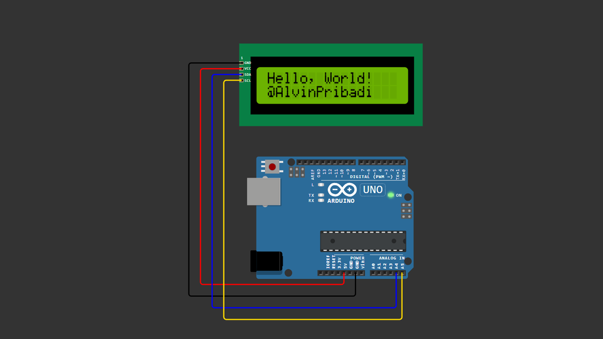

# Arduino LCD I2C Hello World

Basic Arduino project to display **"Hello, World!"** on a 16x2 LCD with I2C module.

Perfect project for beginners who want to learn how to use LCD I2C with Arduino.

---

## 🧰 Components

- 1x Arduino Uno
- 1x LCD 16x2 with I2C module
- 4x Jumper wires
- USB cable

---

## 🔌 Wiring (Arduino Uno)

| LCD I2C | Arduino |
|----------|----------|
| VCC      | 5V       |
| GND      | GND      |
| SDA      | A4       |
| SCL      | A5       |

For Arduino Mega:
- SDA = 20
- SCL = 21

---

## 📷 Wiring Diagram

> Make sure your wiring matches the diagram above before uploading the code.

---

## 💻 Arduino Code

You can download the Arduino sketch here:

[Download Arduino Code](Arduino_LCD_I2C_Hello_World.ino)

Or open the `.ino` file directly inside this repository.

---

## 📚 Install Library

1. Open Arduino IDE
2. Click **Sketch**
3. Select **Include Library**
4. Click **Manage Libraries**
5. Search: `LiquidCrystal I2C`
6. Install library by **Frank de Brabander**
7. Restart Arduino IDE (recommended)

---

## ⚙️ I2C Address

Common I2C address:
- `0x27`
- If not working, try `0x3F`

You can scan I2C address using I2C Scanner example.

---

## ▶️ How It Works

The program initializes the LCD, turns on the backlight, and prints:

Hello, World!

@AlvinPribadi

on the LCD screen.

---

## 📺 Video Tutorial

Watch the full tutorial here:  

---

## 📜 License

Free to use for learning and educational purposes.
